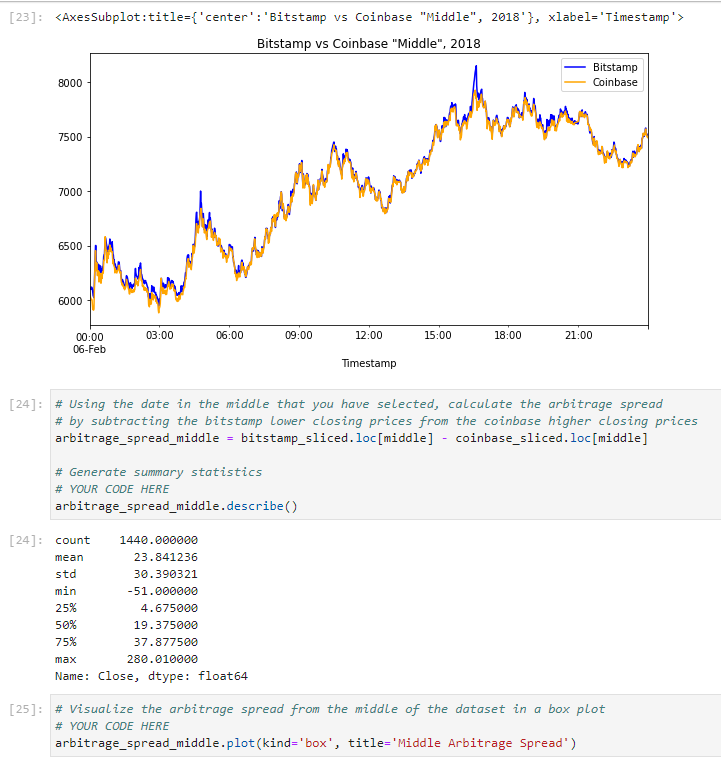

# module_3_challenge

# Module 3 Challenge

The module 3 challenge for fintech course

The Jupyter Lab file follows along as an exercise to analyze arbitrage
opportunities between bitstamp and coinbase for Jan-Mar of 2018.
---

## Technologies

The sheet requires Pandas for analyzing data frames in jupyter labs.
It requires Jupyter Labs for a user interface.
It requires Path from pathlib to help read .csv files.
Display is used from IPython.display to help output multiple things in each cell.
---

## Installation Guide

Other than Python 3.7, no installation is necessary, Jupyter Labs runs in a browser, including Chrome.  Launch the file by navigating to the directory of the file through a CLI and then running Jupyter labs, with "jupyter lab".
---

## Usage

The worksheet runs through a scenario and allows the user to manipulate arbitrage opportunities between different BTC exchanges.

---

## Contributors

Michael Canavan

---

## License

the content of the course is owned and managed by UC Berkeley Fintech Bootcamp.